# Labirinto utilizando BFS e DFS
## Introdução

  Para a resolução do problema do labirinto, que consiste em criar uma matriz quadrada NxN e marcar obstáculos do labirinto. O algoritmo deve caminhar pela matriz, saindo da posição (0,0) e tendo "END GAME" na posição NxN. No caso do código fonte disponibilizado, trabalhamos com entradas de matrizes com tamanho 6x6. Para a solução utilizamos estruturas básicas nos respectivos repositórios, <a href = "https://github.com/mpiress/dynamic_list">Lista Dinâmica</a>, <a href = "https://github.com/mpiress/dynamic_stack">Pilha Dinâmica</a>, <a href = "https://github.com/mpiress/dynamic_queue">Fila Dinâmica</a> do professor <a href ="https://github.com/mpiress">Michel Pires</a>. 
   BFS - BREADTH FIRST SEARCH. Utiliza Fila, cujo o primeiro elemento a entrar é o primeiro elemento a sair. 
   DFS - DEPTH FIRST SEARCH. Utiliza Pilha em dois estágios.

## Lógica

  O desenvolvimento se baseia em 3 etapas:
  <ol>
    <li> Leitura dos dados das matrizes</li>
    <li> Execução do BFS com a respectiva entrada</li>
    <li> Execução do DFS com a respectiva entrada</li>
</ol>
  1. A leitura das matrizes são feitas nos arquivos chamados entradaX.txt (X indo de 1 a 6).  
  2. O algoritmo BFS foi desenvolvido utilizando Fila dinâmica. Utilizando as funções Enfileira e Desenfileira para execução lógica. 
  3. O algoritmo DFS foi desenvolvido utilizando Pilha Dinâmica. Utilizando as funções PUSH e POP para execução lógica.

## Imagens e Exemplos

### Menu Inicial

  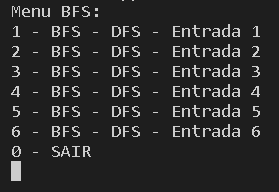</img>

### Main

  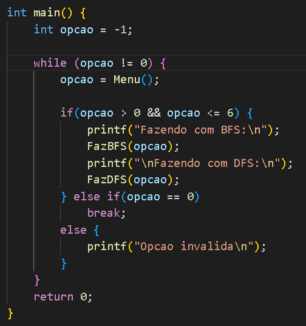</img>

### Entradas

  
  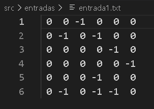</img>
  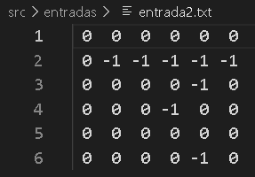</img>
  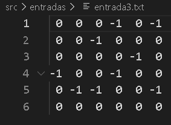</img>
   
  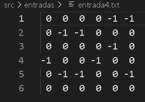</img>
  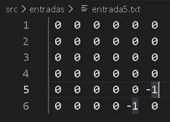</img>
  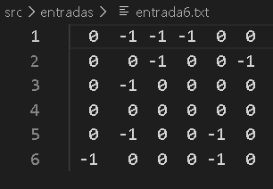</img>
  

### Saídas

  
  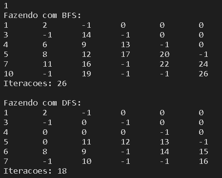</img>
  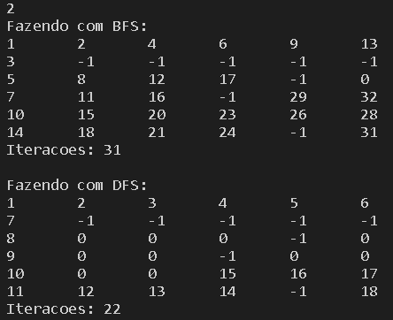</img>
   

#### Entrada Inválida

  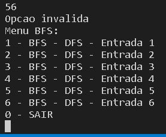</img>

# Conclusão

  Dados as execuções, foi avaliado conforme o número de iterações que o algoritmo DFS é mais rápido que o algoritmo BFS.

# Compilação e Execução

Makefile realiza o procedimento de compilação e execução.

|Comando| Funcao|
|----|----|
|`make clean`|Limpa tudo|
|`make r`|Executa a compilação utilizando gcc e executa o programa da pasta build após a realização da compilação.|
